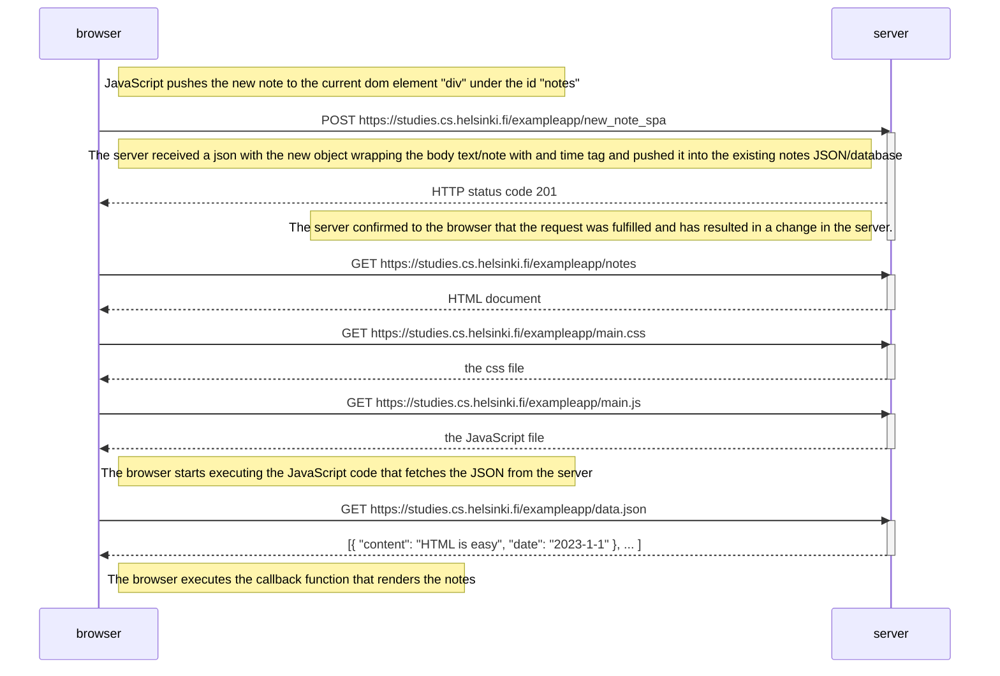

```mermaid
  sequenceDiagram
      participant browser
      participant server

      note right of browser: JavaScript pushes the new note to the current dom element "div" under the id "notes"
      browser->>server: POST https://studies.cs.helsinki.fi/exampleapp/new_note_spa
      activate server
      Note left of server: The server received a json with the new object wrapping the body text/note with and time tag and pushed it into the existing notes JSON/database

      server-->>browser: HTTP status code 201
      Note left of server: The server confirmed to the browser that the request was fulfilled and has resulted in a change in the server.
      deactivate server


      browser->>server: GET https://studies.cs.helsinki.fi/exampleapp/notes
      activate server
      server-->>browser: HTML document
      deactivate server

      browser->>server: GET https://studies.cs.helsinki.fi/exampleapp/main.css
      activate server
      server-->>browser: the css file
      deactivate server

      browser->>server: GET https://studies.cs.helsinki.fi/exampleapp/main.js
      activate server
      server-->>browser: the JavaScript file
      deactivate server

      Note right of browser: The browser starts executing the JavaScript code that fetches the JSON from the server

      browser->>server: GET https://studies.cs.helsinki.fi/exampleapp/data.json
      activate server
      server-->>browser: [{ "content": "HTML is easy", "date": "2023-1-1" }, ... ]
      deactivate server

      Note right of browser: The browser executes the callback function that renders the notes
```
